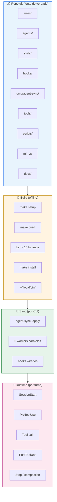
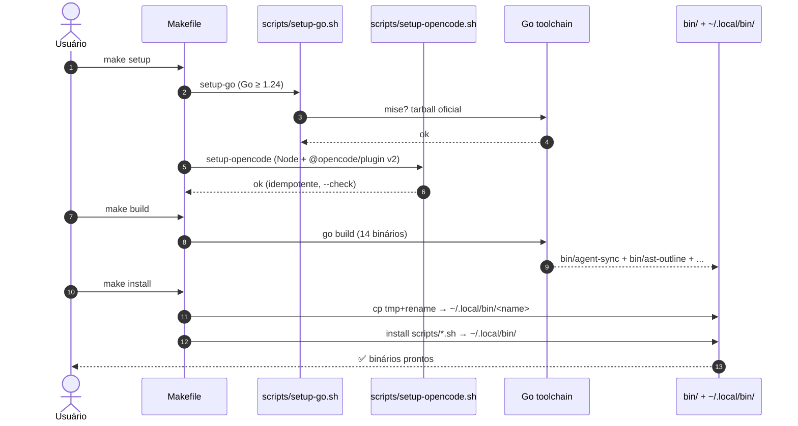
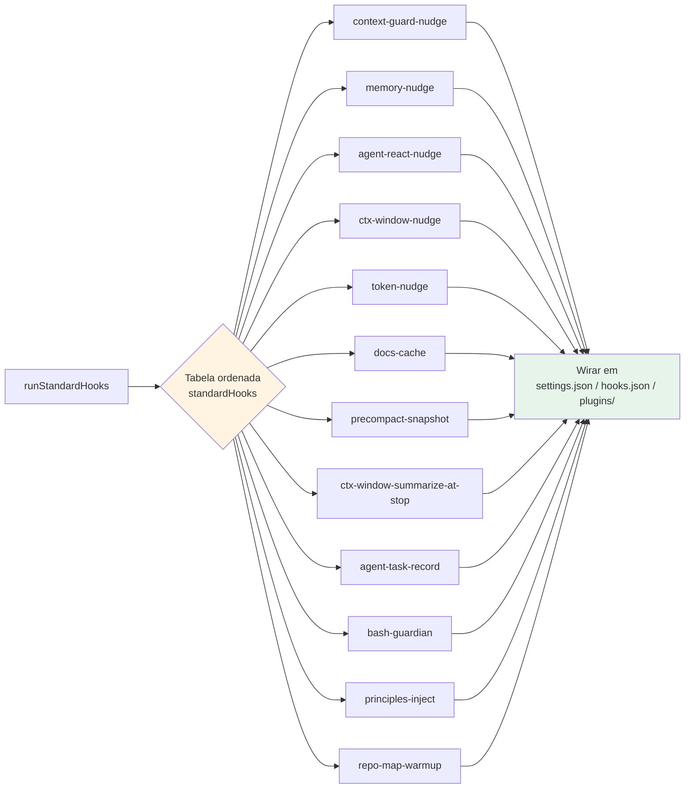
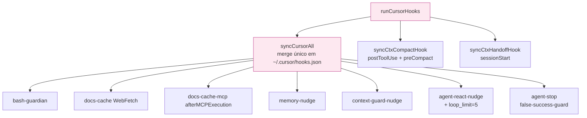
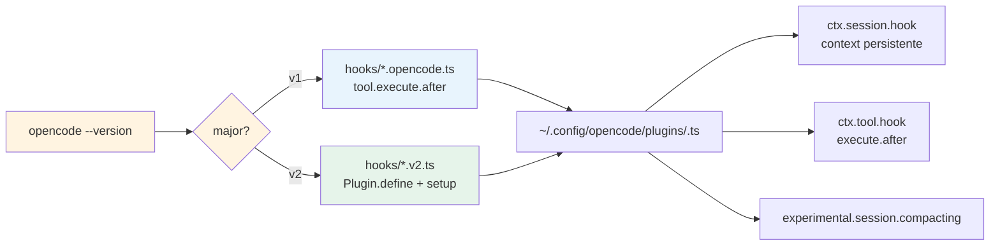
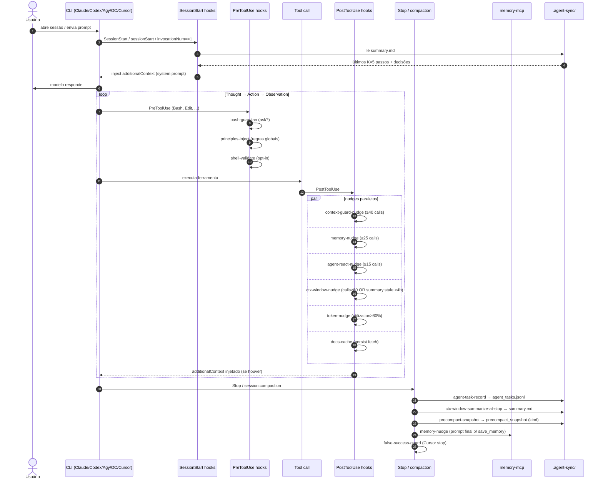
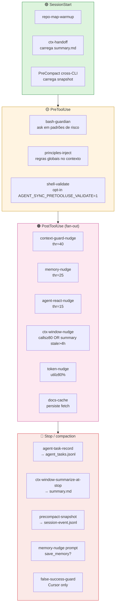
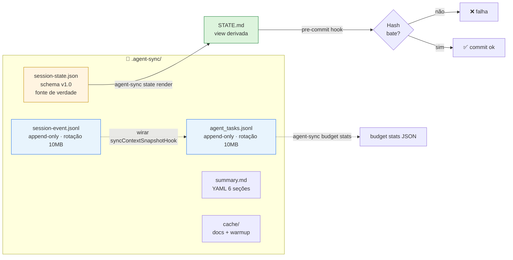
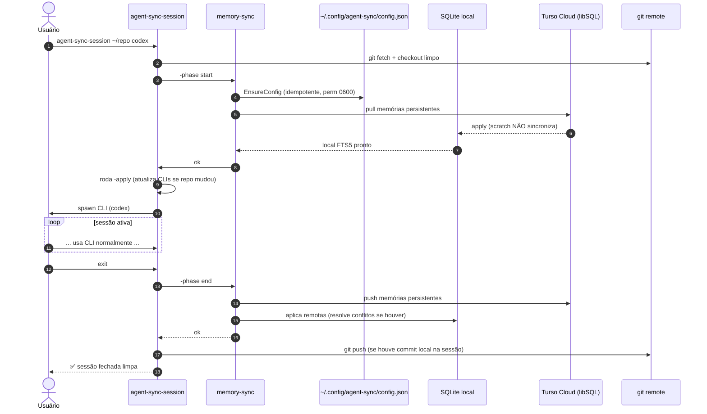

# Fluxo arquitetural do agent-sync

Documento operacional que costura os fluxos end-to-end do projeto: da
origem versionada no repositório até o runtime em cada uma das cinco
CLIs suportadas, passando pelo estado canônico e pelo ciclo de
sincronização entre PCs.

> Complementa o `README.md` (visão geral) e as ADRs em `../` (decisões
> de design específicas). Aqui o foco é o **fluxo**: como um artefato
> viaja de um lado para o outro.

---

## Sumário

1. [Camadas do sistema](#1-camadas-do-sistema)
2. [Fluxo 1 — Bootstrap (clone → binários)](#2-fluxo-1--bootstrap-clone--binários)
3. [Fluxo 2 — Sincronização (`-apply`)](#3-fluxo-2--sincronização--apply)
4. [Fluxo 3 — Runtime em uma sessão de agente](#4-fluxo-3--runtime-em-uma-sessão-de-agente)
5. [Fluxo 4 — Estado canônico e auditoria](#5-fluxo-4--estado-canônico-e-auditoria)
6. [Fluxo 5 — Cross-PC (Turso Cloud)](#6-fluxo-5--cross-pc-turso-cloud)
7. [Matriz de hooks/plugins por CLI](#7-matriz-de-hooksplugins-por-cli)
8. [Tabela de fluxos críticos](#8-tabela-de-fluxos-críticos)

---

## 1. Camadas do sistema



**Princípio**: cada camada é **idempotente** e pode ser refeita do zero
a partir da anterior. Não há estado mutável que escape do git.

---

## 2. Fluxo 1 — Bootstrap (clone → binários)



**Pontos-chave**:

- `setup-opencode.sh` é **idempotente** (`--check` mode) — refs D-44.
- `make install` usa padrão tmp+rename (`cp .tmp && mv -f`) — não deixa
  binário parcial em uso se interrompido.
- Compila **2 módulos Go**: raiz (`./cmd/agent-sync`) e `tools/`
  (`go.mod` separado).

### Mapa de binários produzidos

| Binário | Origem | Papel |
|---|---|---|
| `agent-sync` | `cmd/agent-sync` (73 arquivos) | Orquestrador de sync + subcommands (`state`, `event`, `budget`, `skills`) |
| `ast-outline` | `tools/cmd/ast-outline` | Outline de classes/métodos (Go/Py/TS/PHP) |
| `trace-strip` | `tools/cmd/trace-strip` | Filtra stack traces ruidosos |
| `db-guardian` | `tools/cmd/db-guardian` | Valida SQL read-only (NÃO executa) |
| `docs-fetch` | `tools/cmd/docs-fetch` | Baixa/cacheia docs (online + offline) |
| `docs-mcp` | `tools/cmd/docs-mcp` | MCP local offline sobre o cache |
| `docs-cache-write` | `tools/cmd/docs-cache-write` | Escrita do cache (usado por hooks) |
| `memory-mcp` | `tools/cmd/memory-mcp` | MCP de memória (libSQL + CGO) |
| `memory-sync` | `tools/cmd/memory-sync` | Sync entre PCs via Turso |
| `mr-collect-cli` | `tools/cmd/mr-collect-cli` | Coleta MR/PR via `glab`/`gh` (self-hosted zero-config) |
| `mr-review-local` | `tools/cmd/mr-review-local` | Coleta `git diff base..head` p/ agente |
| `ctx-window` | `tools/cmd/ctx-window` | Sliding window K=5 + summary |
| `false-success-guard` | `tools/cmd/false-success-guard` | Detecta "alegação sem evidência" (Cursor) |
| `shell-validate` | `tools/cmd/shell-validate` | Opt-in: valida shell antes de executar |
| `repo-map` | `tools/cmd/repo-map` | Mapa incremental do repo |
| `git-diff-summary` | `tools/cmd/git-diff-summary` | Diff resumido |
| `delegate-run` | `scripts/delegate-run.sh` | Wrapper p/ delegar entre CLIs (log + tmux) |
| `agent-sync-session` | `scripts/agent-sync-session.sh` | Wrapper de sessão: pull + sync + push |

---

## 3. Fluxo 2 — Sincronização (`-apply`)

### 3.1 Pipeline geral

```mermaid
flowchart TB
    A[agent-sync -apply] --> B[resolveBaseDir<br/>AGENT_SYNC_HOME &gt; exePath &gt; cwd]
    B --> C[Coletar sources<br/>rules + skills + agents + hooks]
    C --> D{Para cada CLI<br/>detectada no host}

    D -->|Claude| W1[worker claude]
    D -->|Codex| W2[worker codex]
    D -->|Antigravity| W3[worker agy]
    D -->|OpenCode| W4[worker opencode]
    D -->|Cursor| W5[worker cursor]

    W1 --> E1[runStandardHooks]
    W2 --> E1
    W3 --> E1
    W4 --> E1
    W5 --> E2[runCursorHooks<br/>syncCursorAll + ctx-compact + ctx-handoff]

    E1 --> F[~/.{claude,codex,gemini,config/opencode,cursor}]
    E2 --> F

    style A fill:#fff4e1,stroke:#bf8700
    style W1 fill:#e8f4fd,stroke:#1f6feb
    style W2 fill:#e8f4fd,stroke:#1f6feb
    style W3 fill:#e8f4fd,stroke:#1f6feb
    style W4 fill:#e8f4fd,stroke:#1f6feb
    style W5 fill:#fde8f0,stroke:#bf3989
```

**Garantias**:

- Workers rodam em **goroutines paralelas**, cada um com `workerLog`
  isolado (sem intercalação no terminal).
- `applyContext` agrupa deps (paths + log) para evitar propagar 4 args
  em todas as funções `run*()`.
- **Idempotência total**: re-rodar `-apply` é seguro (merge de
  `settings.json`/`hooks.json` preserva entradas existentes).

### 3.2 Caminho padrão (`standardHooks`)

Aplicado em Claude, Codex, Antigravity, OpenCode v1:



**Tabela ordenada** (`standardHooks` em `cmd/agent-sync/main.go`) — a
ordem importa porque `mergeJSON` preserva chaves anteriores; novos
entries entram no final.

### 3.3 Caminho Cursor (`runCursorHooks`)



**Diferenças em relação aos outros targets**:

- Merge **único** em `~/.cursor/hooks.json` (Cursor não aceita múltiplas
  sources como Claude/Codex).
- `agent-react-nudge.stop.cursor.sh` tem **`loop_limit=5`** dedicado
  (decisão D-20) — dedup por `conversation_id` em
  `$TMPDIR/agent-sync-react-nudge-cursor-stop/<conv>.last` para não
  repetir quando Cursor injeta múltiplas vezes.
- `bash-guardian.cursor.sh` devolve `{"permission":"ask"}` (Cursor
  suporta confirmação interativa nativamente — Codex não, fica de fora).

### 3.4 OpenCode v2 — caminhos paralelos



**Decisão D-26**: `-apply` detecta major via `opencode --version`
(override `AGENT_SYNC_OPENCODE_VERSION=1|2`, fallback v1). Plugins
**only-v2** (ex.: `repo-map-warmup`, `precompact-snapshot`) ficam
silenciosos em v1.

**Bug pré-existente corrigido (D-33)**: `syncOpenCodePluginVersioned`
tentava sufixo `.v2.ts` enquanto plugins novos seguem
`<base>.opencode.v2.ts` em disco. Fix: precedência para
`.opencode.v2.ts`, fallback `.v2.ts`.

---

## 4. Fluxo 3 — Runtime em uma sessão de agente

### 4.1 Ciclo de vida de um turno



### 4.2 Mapa de hooks por fase do turno



### 4.3 Thresholds (configuráveis por env)

| Hook | Env var | Default | Comportamento |
|---|---|---:|---|
| `memory-nudge` | `AGENT_SYNC_MEMORY_NUDGE_THRESHOLD` | 25 | "Algo da sessão deveria virar `store_memory`?" |
| `context-guard-nudge` | `AGENT_SYNC_NUDGE_THRESHOLD` | 40 | "Atualizar `STATE.md`?" |
| `agent-react-nudge` | `AGENT_SYNC_REACT_NUDGE_THRESHOLD` | 15 | "Validou hipótese ativa?" |
| `shell-validate` | `AGENT_SYNC_PRETOOLUSE_VALIDATE=1` | off | Sinaliza comandos provavelmente inválidos |
| `ctx-window-nudge` | (interno) | calls≥80 ou summary>4h | "Hora de sumarizar?" |
| `token-nudge` | `AGENT_SYNC_TOKEN_NUDGE_THRESHOLD` | 80% | "Janela ≥ 80%, considere compactar" |

---

## 5. Fluxo 4 — Estado canônico e auditoria



### 5.1 Princípios (decisão D-7)

1. **`session-state.json` é a fonte de verdade** — schema fechado
   (`additionalProperties: false`), validado por `tools/jsonschema`
   (ADR-001, lib `santhosh-tekuri/jsonschema/v6`).
2. **`STATE.md` é uma view derivada** — gerada por
   `agent-sync state render`. Edição manual quebra o pre-commit (hash
   mismatch).
3. **`session-event.jsonl` e `agent_tasks.jsonl` são append-only** —
   rotação single-rotation a 10MB. Eventos nunca são mutados.

### 5.2 Tipos canônicos (D-48)

| Tipo | Critério de entrada | Status |
|---|---|---|
| `decision` | Limita opções futuras (ex.: "lockless tmpfile + 3 retries") | sem status |
| `task` | Trabalho com `done` verificável | `pending` / `done` / `cancelled` |
| `issue` | Quebrado/bloqueante | `open` / `closed` |

> Trilhas viram **tags** (`trilha_c`, `trilha_a`), não categorias.

---

## 6. Fluxo 5 — Cross-PC (Turso Cloud)



### 6.1 Resolução de conflitos

```bash
# conflito detectado em memory X
memory-sync -phase resolve-local -conflict X   # mantém versão local
memory-sync -phase resolve-remote -conflict X  # aceita versão remota
# depois repete a sincronização
```

### 6.2 Garantias

- Memórias `scratch: true` **nunca** sincronizam (D-13).
- Config criado com perm `0600` e **não** sobrescrito se já existir.
- Token fica fora do repo (`~/.config/agent-sync/config.json`,
  `.gitignore`-friendly por convenção).
- `apply`/`push` separados — `git push` só roda no final da sessão.

---

## 7. Matriz de hooks/plugins por CLI

Legenda: ✅ wirado + smoke aceito · 🟡 workaround documentado · ⛔
gap aceito (impossível via harness) · ❌ não implementado

| Hook / Plugin | Claude | Codex | Antigravity | OpenCode | Cursor |
|---|:-:|:-:|:-:|:-:|:-:|
| `bash-guardian` (ask) | ✅ | ❌ | ✅ | ✅ | ✅ |
| `context-guard-nudge` | ✅ | ✅ | ✅ | ✅ (best-effort) | ✅ |
| `memory-nudge` | ✅ | ✅ | ✅ | ✅ (best-effort) | ✅ |
| `agent-react-nudge` | ✅ | ✅ | ✅ | ✅ (best-effort) | ✅ + `loop_limit=5` |
| `docs-cache` (WebFetch) | ✅ | — | ✅ | ✅ (best-effort) | ✅ |
| `docs-cache-mcp` (ctx7) | ✅ | ✅ | ✅ | ✅ (best-effort) | ✅ |
| `ctx-window-nudge` | ✅ | ✅ | ✅ | ✅ (v2) | ✅ |
| `ctx-window-summarize-at-stop` | ✅ Stop | ✅ Stop | 🟡 | 🟡 `session.compaction` proxy | ✅ stop |
| `precompact-snapshot` | ✅ exit 2 | ✅ `continue:false` | 🟡 PreInvocation proxy | ✅ `experimental.session.compacting` (v2) | ⛔ observacional |
| `token-nudge` | ✅ transcript parse | ✅ nativo model | 🟡 heurística | ✅ `ctx.client.session.tokens` (v2) | 🟡 heurística |
| `agent-task-record` | ✅ Stop | ✅ Stop | ✅ Stop | 🟡 separado | ✅ stop |
| `agent-stop` (false-success-guard) | — | — | — | — | ✅ |
| `principles-inject` (PreToolUse) | ✅ | ✅ | — | — | — |
| `repo-map-warmup` | ✅ SessionStart | ✅ SessionStart | ✅ 1ª invocação | ✅ SessionStart | ✅ sessionStart |
| `mr-review-local` (CLI) | ✅ | ✅ | ✅ | ✅ | ✅ |
| `mr-collect-cli` (CLI) | ✅ | ✅ | ✅ | ✅ | ✅ |
| `docs-fetch` (CLI) | ✅ | ✅ | ✅ | ✅ | ✅ |

> **OpenCode best-effort**: [#13574](https://github.com/anomalyco/opencode/issues/13574) —
> mutações de output do hook nem sempre são refletidas ao modelo.

---

## 8. Tabela de fluxos críticos

| # | Fluxo | Entrada | Saída | Comando / hook |
|---|---|---|---|---|
| 1 | Bootstrap | repo clonado | binários em `~/.local/bin` | `make setup && make install` |
| 2 | Sync CLIs | source no repo | hooks/plugins wirados | `agent-sync -apply` |
| 3 | Status | — | tabela por CLI | `agent-sync -status` |
| 4 | Vendor skills | `skills/manifest.json` | `skills/<id>/SKILL.md` | `agent-sync -vendor` |
| 5 | Cobertura skills | `skills/` × manifest | relatório (installed/orphan/missing) | `agent-sync skills index` |
| 6 | Criar skill local | id + description + domain + bundle | `skills/<id>/SKILL.md` (orphaned) | `agent-sync skills new` |
| 7 | Retomar sessão | `.agent-sync/summary.md` | contexto injetado | SessionStart hooks |
| 8 | Resumir agora | transcript recente | `.agent-sync/summary.md` | `ctx-window summarize` |
| 9 | Salvar memória | decisão/feedback | `memory.db` (local + Turso) | `memory-mcp.store_memory` |
| 10 | Drift detection | edits em STATE.md | pre-commit fail | hash mismatch (D-7) |
| 11 | Cross-PC | config turso | memórias persistentes | `memory-sync -phase start/end` |
| 12 | MR review local | `git diff base..head` | JSON p/ agente | `mr-review-local` |
| 12a | MR review via CLI | `glab`/`gh` autenticado | JSON p/ agente | `mr-collect-cli` |
| 13 | Budget tracking | tool calls × modelo | `agent_tasks.jsonl` | `agent-task-record.stop.sh` + `agent-sync budget` |
| 14 | Cache de docs | WebFetch/ctx7 call | `~/.cache/agent-sync/docs/` | `docs-cache.{sh,opencode.ts,cursor.sh,...}` |
| 15 | PreCompact snapshot | transcript pré-compact | `precompact_snapshot` (kind) | `precompact-snapshot.{sh,opencode.v2.ts,...}` |
| 16 | Token nudge | tokens in/out | additionalContext | `token-nudge.check.sh` + plugin v2 |
| 17 | False-success-guard | Cursor stop transcript | bloqueia conclusão sem evidência | `agent-stop.cursor.sh` |
| 18 | Repository map | repo local | mapa incremental | `repo-map-warmup.*` |

---

## Anexo A — Saídas verificáveis após `-apply`

```bash
# Estrutura esperada após agent-sync -apply em um host com as 5 CLIs:

~/.claude/
├── settings.json                      # hooks + permissions mesclados
└── (skills/agents via -apply)         # conforme CLAUDE_HOME

~/.codex/
├── hooks.json                         # hooks mesclados (PostToolUse)
└── AGENTS.md ou similar               # regras globais

~/.gemini/
└── config/hooks.json                  # formato antigravity (sem "hooks" wrapper)

~/.config/opencode/
├── plugins/                           # *.ts wirados (v1 ou v2 conforme versão)
│   ├── context-guard-nudge.ts
│   ├── memory-nudge.ts
│   ├── agent-react-nudge.ts
│   ├── ...
│   └── package.json                   # deps (D-45: --save, não --no-save)
└── opencode.json                      # permission.bash (bash-guardian)

~/.cursor/
├── hooks.json                         # merge único (Cursor)
├── hooks/                             # scripts referenciados
│   ├── context-guard-nudge.cursor.sh
│   ├── memory-nudge.cursor.sh
│   ├── agent-react-nudge.cursor.sh
│   └── agent-react-nudge.stop.cursor.sh
├── skills/                            # symlinks p/ skills instaladas
└── agents/                            # *.md (model: inherit)
```

---

## Anexo B — Como usar este documento

- **Onboarding**: leia §1 (camadas) + §2 (bootstrap) antes de tudo.
- **Debug de hook que não dispara**: vá a §4.1 (ciclo de vida) →
  localize a fase → §7 (matriz) → confirme cobertura na CLI afetada.
- **Debug de sync que falha**: §3 (pipeline) → §3.2/§3.3 (caminho
  padrão vs Cursor) → logs do worker específico.
- **Debug de estado**: §5 (estado canônico) + `agent-sync state render`
  + `agent-sync budget stats`.
- **Cross-PC**: §6 + `docs/guides/sync-between-pcs.md`.

---

> Última atualização: ver `STATE.md` (renderizado de
> `.agent-sync/session-state.json`).
