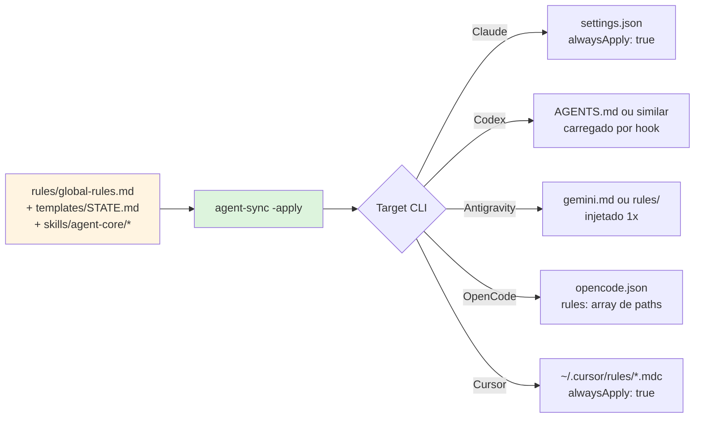
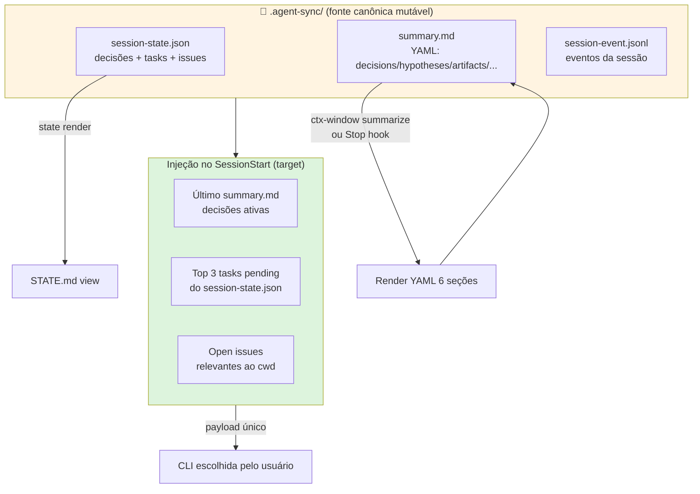
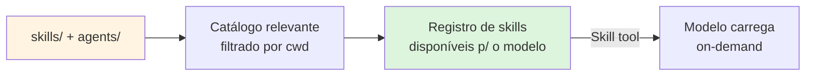
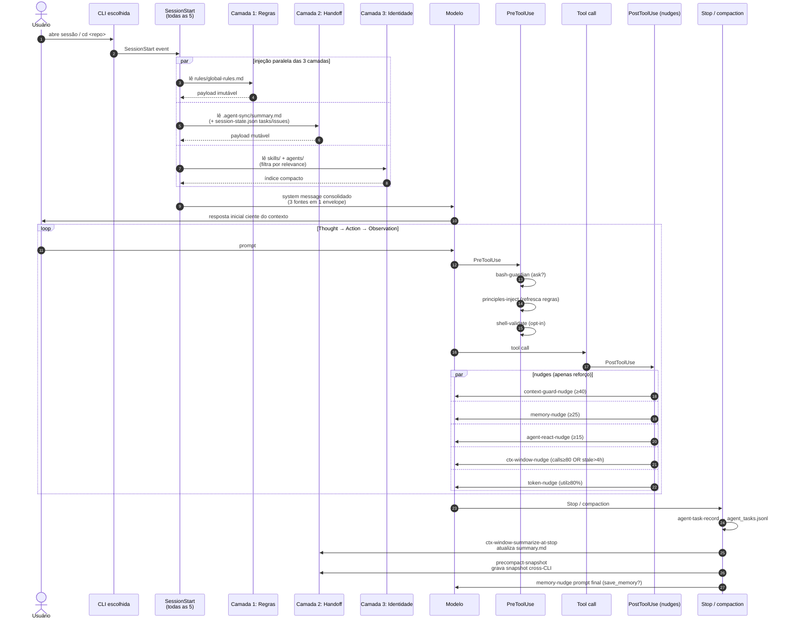

# Fluxo Ideal (Target State) — agent-sync

> Documento de design. **NÃO descreve o que existe hoje** — descreve o
> que **deveria** existir para que toda sessão de qualquer CLI
> receba, automaticamente e sem gaps, a verdade canônica do projeto.
>
> Use em conjunto com `architecture-flow.md` (fluxo atual) e a matriz
> da [Trilha C](../ADR-trilha-c-cobertura-cross-cli.md).

---

## Princípio de design

Toda sessão de agente, em qualquer uma das 5 CLIs, deve abrir com **3
fontes canônicas injetadas de forma idêntica**:

1. **Regras globais** (imutáveis, vêm do repo)
2. **Handoff de trabalho** (mutável, vem de `.agent-sync/`)
3. **Identidade do projeto** (skills + agents relevantes)

Esses 3 grupos são injetados **uma única vez** no SessionStart, antes
do primeiro prompt do usuário. Nudges no PostToolUse apenas **reforçam**
— não substituem — o que foi injetado no início.

---

## Sumário

1. [Camada 1 — Regras globais (imutáveis)](#1-camada-1--regras-globais-imutáveis)
2. [Camada 2 — Handoff de trabalho (mutável)](#2-camada-2--handoff-de-trabalho-mutável)
3. [Camada 3 — Identidade do projeto](#3-camada-3--identidade-do-projeto)
4. [Diagrama: sessão ideal completa](#4-diagrama-sessão-ideal-completa)
5. [Matriz target: o que cada CLI DEVE injetar](#5-matriz-target-o-que-cada-cli-deve-injetar)
6. [Gaps a fechar (mapeados na Trilha C)](#6-gaps-a-fechar-mapeados-na-trilha-c)
7. [Critério de aceitação](#7-critério-de-aceitação)

---

## 1. Camada 1 — Regras globais (imutáveis)



### Comportamento target

- **`rules/global-rules.md`** é injetado **na abertura** (não só em
  PreToolUse) — hoje está em `PreToolUse` via `principles-inject` (visto
  em `hooks/principles-inject.pretooluse.sh:42`), o que significa que o
  modelo só vê as regras ao chamar uma tool. **Gap**: modelo pode
  responder perguntas de design sem nunca ter visto as regras.
- **Injeção ideal**: usar o evento nativo da CLI para injetar no
  `system` / `systemMessage` no SessionStart, **antes** do primeiro
  turno.
- **Idempotência**: o conteúdo é versionado (git), então é sempre o
  mesmo entre PCs. Sincronização via `-apply` resolve.

### Comparativo hoje vs ideal

| CLI | Hoje | Ideal |
|---|---|---|
| Claude | `PreToolUse` → `additionalContext` (1x/sessão) | `SessionStart` → `system` message |
| Codex | mesmo padrão | `SessionStart` → `additionalContext` |
| Antigravity | `PreInvocation invocationNum==1` → `ephemeralMessage` (✅ já!) | manter |
| OpenCode v2 | `ctx.session.hook("context")` (já wirado em plugins v2) | manter + wirar em v1 |
| Cursor | não wirado em `sessionStart` | `sessionStart` → `additional_context` |

---

## 2. Camada 2 — Handoff de trabalho (mutável)



### Comportamento target

Toda sessão, ao abrir, deve receber **um único payload consolidado**
contendo:

```yaml
# Injetado em SessionStart (target state)
handoff:
  last_summary: |          # conteúdo de summary.md (se < 4h)
    decisions:
      - "D-37 gaps 🟡/⛔ viram A-N"
      - "D-44 setup-opencode.sh é idempotente"
    active_hypotheses: []
    next_steps: [...]
  pending_tasks:           # top N do session-state.json
    - id: A-32
      title: "subcommand skills new"
      status: pending
  open_issues: []          # bugs/gaps conhecidos
  session_age: 2h          # idade da última sessão
  warn_if_stale: true      # se summary > 4h, avisa
```

### Comparativo hoje vs ideal

| CLI | Hoje | Ideal |
|---|---|---|
| **Cursor** | ✅ wirado em `sessionStart` via `syncCtxHandoffHook` | ✅ manter |
| **OpenCode v2** | ✅ via `ctx.session.hook("context")` em plugins v2 | ✅ manter |
| **Claude Code** | ❌ só PreCompact injeta (D-30); SessionStart não injeta | SessionStart injeta `summary.md` |
| **Codex** | ❌ mesmo gap | SessionStart injeta `summary.md` |
| **Antigravity** | 🟡 PreInvocation 1ª injeta diretriz, mas **não** lê summary.md | PreInvocation 1ª injeta `summary.md` consolidado |

### Princípio da "verdade única"

O payload injetado deve ser **idêntico** nas 5 CLIs (mesma fonte,
mesma forma). Hoje cada CLI injeta de um jeito diferente (ou não
injeta). O target é ter um **único renderer** que produz o mesmo YAML
e cada CLI só envelopa no formato nativo (`additionalContext`,
`ephemeralMessage`, `additional_context`, etc).

---

## 3. Camada 3 — Identidade do projeto



### Comportamento target

- **Skills** e **agents** continuam sendo wirados como arquivos/symlinks
  (já é assim hoje). O modelo descobre via `skill` tool ou via nome
  do agente no system prompt.
- **Diferença target**: a saída do `agent-sync skills index` deve
  aparecer **no payload do SessionStart** como lista compacta (não
  embute conteúdo, só lista `"<domain>/<id> — <description>"`).
- **Agentes read-only** ganham `permission.edit=deny` no OpenCode,
  `sandbox_mode=read-only` no Codex, `readonly: true` no Cursor — já é
  o caso hoje (verificado no README, decisão D-22).

### Comparativo hoje vs ideal

| CLI | Hoje | Ideal |
|---|---|---|
| Claude | Skills em `~/.claude/skills/` (symlinks) | ✅ + índice no SessionStart |
| Codex | Skills em `~/.codex/skills/` | ✅ + índice |
| Antigravity | Skills em `~/.gemini/skills/` | ✅ + índice |
| OpenCode | Skills em `~/.config/opencode/skills/` | ✅ + índice |
| Cursor | Skills em `~/.cursor/skills/` (symlinks, **nunca** `skills-cursor/`) | ✅ + índice |

---

## 4. Diagrama: sessão ideal completa



---

## 5. Matriz target: o que cada CLI DEVE injetar

Legenda: ✅ já wirado · ⚠️ wirado parcialmente (precisa estender) ·
❌ gap a fechar

### 5.1 No SessionStart

| Injeção | Claude | Codex | Antigravity | OpenCode v1 | OpenCode v2 | Cursor |
|---|:-:|:-:|:-:|:-:|:-:|:-:|
| Regras globais (camada 1) | ⚠️ PreToolUse only | ⚠️ PreToolUse only | ✅ PreInvocation 1ª | ❌ | ✅ ctx.session.hook | ❌ |
| Handoff `summary.md` (camada 2) | ❌ | ❌ | ❌ | ❌ | ✅ plugin v2 | ✅ sessionStart |
| Top tasks/issues (camada 2) | ❌ | ❌ | ❌ | ❌ | ❌ | ❌ |
| Índice de skills (camada 3) | ❌ | ❌ | ❌ | ❌ | ❌ | ❌ |
| `repo-map-warmup` (background) | ✅ | ✅ | ✅ | ✅ | ✅ | ✅ |

### 5.2 No PreToolUse

| Hook | Claude | Codex | Antigravity | OpenCode v1/v2 | Cursor |
|---|:-:|:-:|:-:|:-:|:-:|
| `bash-guardian` (ask) | ✅ | ❌ nativo | ✅ | ✅ | ✅ |
| `principles-inject` | ✅ | ✅ | — | — | — |
| `shell-validate` (opt-in) | ✅ | ✅ | ✅ | ✅ | ✅ |

### 5.3 No PostToolUse

| Nudge | Claude | Codex | Antigravity | OpenCode v1 | OpenCode v2 | Cursor |
|---|:-:|:-:|:-:|:-:|:-:|:-:|
| `context-guard-nudge` | ✅ | ✅ | ✅ | ✅ | ✅ | ✅ |
| `memory-nudge` | ✅ | ✅ | ✅ | ✅ | ✅ | ✅ |
| `agent-react-nudge` | ✅ | ✅ | ✅ | ✅ | ✅ | ✅ + `loop_limit=5` |
| `ctx-window-nudge` | ✅ | ✅ | ✅ | ✅ | ✅ | ✅ |
| `token-nudge` | ✅ transcript | ✅ nativo model | ⚠️ heurística | ⚠️ heurística | ✅ `ctx.client.session.tokens` | ⚠️ heurística |
| `docs-cache` (WebFetch) | ✅ | — | ✅ | ✅ | ✅ | ✅ |
| `docs-cache-mcp` (ctx7) | ✅ | ✅ | ✅ | ✅ | ✅ | ✅ |

### 5.4 No Stop / compaction

| Hook | Claude | Codex | Antigravity | OpenCode v1 | OpenCode v2 | Cursor |
|---|:-:|:-:|:-:|:-:|:-:|:-:|
| `agent-task-record` | ✅ | ✅ | ✅ | ⚠️ separado | ⚠️ separado | ✅ stop |
| `ctx-window-summarize-at-stop` | ✅ | ✅ | ⚠️ proxy | ❌ | ⚠️ `session.compaction` proxy | ✅ stop |
| `precompact-snapshot` | ✅ exit 2 | ✅ `continue:false` | ⚠️ PreInvocation proxy | ❌ | ✅ `experimental.session.compacting` | ❌ observacional |
| `agent-stop` (false-success-guard) | — | — | — | — | — | ✅ |
| `memory-nudge` prompt final | ✅ | ✅ | ✅ | ✅ | ✅ | ✅ |

---

## 6. Gaps a fechar (mapeados na Trilha C)

Esta seção traduz os gaps 🟡/⛔ da matriz em **ações estruturadas**
(segundo a regra D-37 → "cada gap vira A-N+").

### 6.1 Camada 1 — Regras globais no SessionStart (hoje só PreToolUse)

- **Gap**: Claude, Codex, Cursor injetam regras só em `PreToolUse`,
  não em `SessionStart`. Risco: o modelo responde design/pergunta
  sem nunca ter visto as regras.
- **Target**: mover `principles-inject` para `SessionStart` (ou criar
  `rules-inject.sessionstart.*`) com payload consolidado.
- **Ação proposta**: `A-36 — mover principles-inject para SessionStart`.

### 6.2 Camada 2 — Handoff consolidado nas 5 CLIs

- **Gap**: hoje só Cursor e OpenCode v2 injetam `summary.md`. Claude,
  Codex e Antigravity **não** recebem handoff automático.
- **Target**: 1 renderer único (`agent-sync handoff render --cli X`)
  produz payload idêntico, e cada CLI envelopa no formato nativo.
- **Ação proposta**: `A-37 — renderer de handoff único cross-CLI`.

### 6.3 Camada 2 — Top tasks/issues injetados (hoje: nunca)

- **Gap**: `session-state.json` tem tasks/issues que **nunca**
  chegam ao modelo sem `state render` explícito.
- **Target**: injetar top 3 tasks pending + open issues no
  SessionStart (junto com summary.md).
- **Ação proposta**: `A-38 — tarefas e issues no SessionStart`.

### 6.4 Camada 3 — Índice de skills (hoje: implícito)

- **Gap**: o modelo descobre skills via tool/registro, mas o **índice**
  de skills disponíveis não está no system prompt.
- **Target**: `agent-sync skills index --compact` injeta no
  SessionStart uma lista `"<domain>/<id> — <description>"` (~200 tokens).
- **Ação proposta**: `A-39 — índice de skills no SessionStart`.

### 6.5 Camada 2 — Token nudge para CLIs sem model nativo (heurística)

- **Gap**: hoje Antigravity e Cursor usam heurística de fallback
  (200k default). Sem dados reais do modelo, o nudge pode ser
  impreciso.
- **Target**: Antigravity expõe `model` no payload PreInvocation (verificar);
  Cursor expõe `model` no stop (verificar). Se nativo, usar nativo.
- **Ação proposta**: `A-40 — token-nudge modelo nativo em Antigravity
  e Cursor`.

### 6.6 Camada 2 — PreCompact real em Cursor (⛔)

- **Gap aceito**: Cursor não tem hook com capacidade de bloquear
  compactação. Só observa. Documentado em D-28.
- **Target**: gap aceito na Trilha C; ADR separada se surgir
  alternativa.

### 6.7 Camada 4 — OpenCode CLI /compact headless (⛔ → ✅)

- **Já resolvido em D-38/A-22**: `/api/session/{id}/compact` existe
  em v2.0.11. Não é mais gap; é caminho programático real.

---

## 7. Critério de aceitação

Uma sessão é considerada **ideal** quando atende simultaneamente:

### 7.1 Critérios verificáveis

| # | Critério | Como verificar |
|---|---|---|
| C1 | Regras globais injetadas no SessionStart em **5/5 CLIs** | `agent-sync -status` + smoke planejado |
| C2 | `summary.md` injetado no SessionStart em **5/5 CLIs** | mesmo |
| C3 | Top 3 tasks pending injetadas em **5/5 CLIs** | mesmo |
| C4 | Índice de skills injetado em **5/5 CLIs** | mesmo |
| C5 | `bash-guardian` wirado em **4/5 CLIs** (Codex gap aceito) | mesmo |
| C6 | `precompact-snapshot` wirado em **4/5 CLIs** (Cursor gap aceito) | mesmo |
| C7 | `token-nudge` com modelo nativo em **3/5 CLIs** (Claude+Codex+OC v2) | mesmo |
| C8 | Payload consolidado idêntico nas 5 CLIs (mesma fonte, só envelope difere) | diff de payloads com mesmo input |

### 7.2 Smoke test alvo

Cada item da matriz 5xN acima deve ter smoke aceito
(`docs/SMOKE-TEST-*.md`) seguindo o critério D-23 (≥2 cenários, ≥20
eventos, simulação explícita de compactação).

### 7.3 Princípio "uma fonte, cinco envelopes"

> **Toda a verdade canônica mora em UM lugar** (`.agent-sync/` +
> repo). As 5 CLIs são apenas **viewers** com envelopes diferentes
> para o mesmo conteúdo.

Isso é o oposto de hoje, onde cada CLI tem seu próprio formato de
injeção e sua própria cobertura parcial.

---

## Anexo — Roteiro de implementação

Para mover do estado atual (`architecture-flow.md`) ao ideal
(`ideal-flow.md`):

1. **Curto prazo (1-2 entregas)**:
   - A-36: mover `principles-inject` para SessionStart
   - A-38: injetar tasks/issues no SessionStart

2. **Médio prazo (3-5 entregas)**:
   - A-37: renderer único `agent-sync handoff render`
   - A-39: índice de skills no SessionStart

3. **Já fechado**:
   - A-22: `/compact` programático no OpenCode v2 (D-38)
   - A-40 parcial: token-nudge nativo em Claude/Codex/OC v2

4. **Gaps aceitos (sem A-N)**:
   - Cursor PreCompact (⛔ observacional)
   - Codex `bash-guardian` (gap nativo do harness)

---

> Última atualização: 2026-09-21. Espelha decisões D-7 (JSON
> canônico), D-27 (regra 5xN), D-28 (C-1 PreCompact), D-37 (gaps
> viram A-N), D-38 (OC /compact programático), D-44 (setup-opencode
> idempotente).
